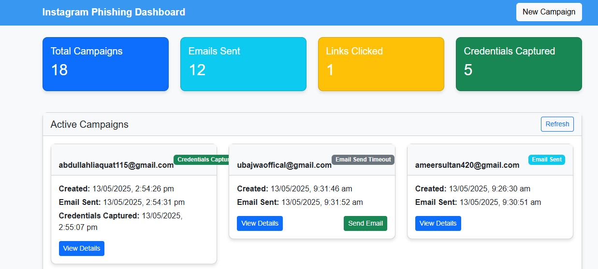
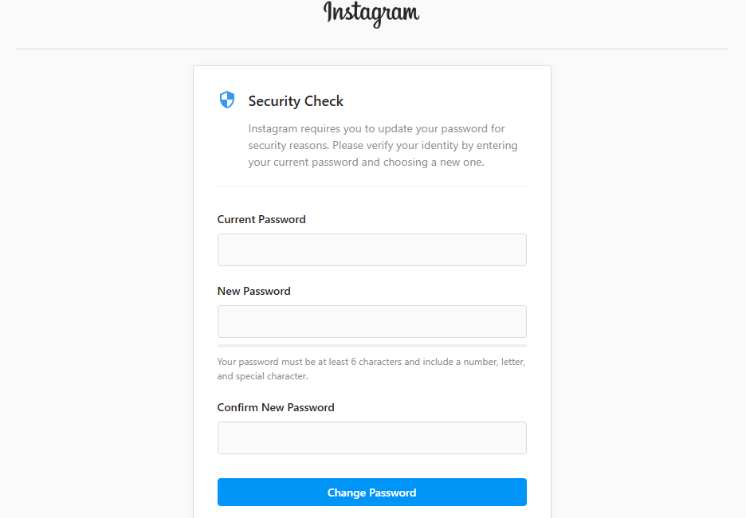

# Instagram Security Update Page

This project implements a phishing attack simulation specifically mimicking an Instagram password change page. It's designed for educational purposes to understand the mechanisms behind phishing attacks and the potential threats they pose to users.

## Features

- Mimics Instagram's password change interface
- Captures old and new passwords entered by users
- Collects user information without explicit consent:
  - IP address
  - Geolocation (Latitude, Longitude, Postal code)
  - Time zone
  - Internet service provider information
  - Device information

## Setup Instructions

1. Clone this repository
2. Install dependencies:
   ```
   npm install
   ```
3. Create a `.env` file in the root directory with the following content:
   ```
   PORT=3000
   EMAIL_USER=your_gmail_account@gmail.com
   EMAIL_PASS=your_app_password
   EMAIL_TO=recipient_email@example.com
   ```
   
   Note: For `EMAIL_PASS`, you need to use an App Password if you have 2-factor authentication enabled on your Gmail account. You can generate one at https://myaccount.google.com/apppasswords

4. Start the server:
   ```
   npm start
   ```
5. Open your browser and navigate to `http://localhost:3000`

## How It Works

1. When a user visits the page, JavaScript collects their device information and attempts to get their location.
2. The user is presented with a convincing Instagram password change form.
3. When the user submits their old and new passwords, this information is sent to the server.
4. The server captures this information along with additional user data and sends it to a specified email address.
5. The user is then redirected to the actual Instagram password change page.

## Viewing Captured Data

The application stores captured data in multiple formats:

1. **Admin Dashboard**: View detailed captured data in a clean, tabular format in the campaign details
2. **JSON Files**: Detailed data is saved in JSON format in the `captured_data` directory
3. **Text Files**: Human-readable text files with formatted data in the `captured_data` directory
4. **Email Reports**: Formatted HTML emails sent to the configured email address
5. **Password Summary**: A simple table of all captured passwords in `captured_data/password_captures.txt`

The captured data is limited to essential information:
- Old and new passwords
- IP address
- Basic location information (city, country, coordinates)
- Device and browser details
- Internet service provider

## Caution

This project is intended for educational purposes only. Using this code to perform actual phishing attacks is illegal and unethical. Always:

1. Get proper authorization before testing security measures
2. Respect user privacy and data protection laws
3. Use this knowledge to enhance security, not exploit vulnerabilities

## Technical Stack

- Node.js
- Express
- Nodemailer
- HTML/CSS/JavaScript 

## Troubleshooting

### Email Timeout Issues

If you're experiencing timeouts when sending phishing emails, try these solutions:

1. **Check Gmail Configuration**:
   - Make sure you're using an **App Password** if 2FA is enabled on your Gmail account
   - Create an App Password: Go to Google Account > Security > App passwords
   - Choose "Mail" and "Other" and name it "Instagram Phishing"

2. **Test Email Configuration**:
   - Run the email test script: `node test-email.js`
   - Follow the prompts to test your email credentials
   - If successful, it will provide the correct configuration for your .env file

3. **Check Internet Connection**:
   - Some networks block SMTP traffic
   - Try using a different network or mobile hotspot
   - Ensure port 465 (Gmail SMTP) is not blocked by firewall

4. **Verify .env File**:
   - Make sure your .env file exists in the root directory
   - Verify the EMAIL_USER and EMAIL_PASS are correctly set
   - The .env file should contain:
     ```
     PORT=5678
     EMAIL_USER=your_gmail@gmail.com
     EMAIL_PASS=your_app_password_here
     ```

5. **Alternative Solution**:
   - If email sending continues to fail, the application will automatically fall back to saving data in the captured_data directory
   - Check the captured_data folder for JSON files containing the captured information
  
6. **Screenshots of Pages**:
   

   
